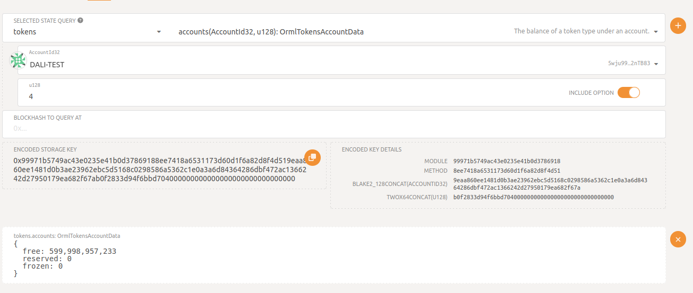
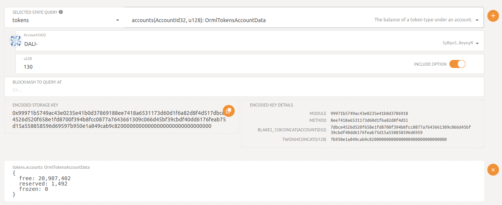
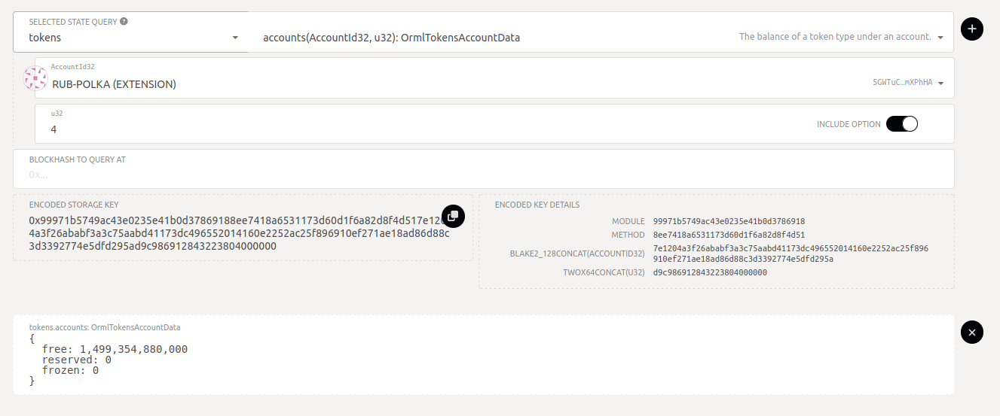

XCM SDK
=======

[](https://www.npmjs.com/package/xcm-sdk)
[](https://circleci.com/gh/blockcoders/xcm-sdk/tree/main)
[](https://coveralls.io/github/blockcoders/xcm-sdk?branch=main)
[](https://www.codacy.com/gh/blockcoders/xcm-sdk/dashboard?utm_source=github.com&amp;utm_medium=referral&amp;utm_content=blockcoders/xcm-sdk&amp;utm_campaign=Badge_Grade)
[](https://opensource.org/licenses/MIT)
[](https://github.com/blockcoders/xcm-sdk/actions/workflows/codeql-analysis.yml)

## Acerca

XCM SDK es una herramienta que proporciona una interfaz para enviar mensajes XCM para cadenas de bloques basadas en Substrate. Esta biblioteca está escrita en Typescript, por lo que se puede importar en un conjunto completamente nuevo de aplicaciones o dApps que usan motores Javascript/Typescript como Node.js.

## Introduccion

### Instalar

```sh
npm i xcm-sdk
```

### Importar

```ts
// JavaScript
const { Provider } = require("xcm-sdk");

// TypeScript
import { Provider } from "xcm-sdk";
```

### Proveedor

```ts
const provider = new Provider(rpc, sender);
```

<table>
  <tr>
    <th>Parametro</th>
    <th>Descripcion</th>
  </tr>
  <tr>
    <td>rpc</td>
    <td>rpc URL</td>
  </tr>
    <tr>
    <td>sender</td>
    <td>firmante de la transacción</td>
  </tr>
</table>

### Ejemplos

Si quieres firmar con Alice en un nodo local:

```ts
import { Keyring } from '@polkadot/keyring'
import { cryptoWaitReady } from '@polkadot/util-crypto'

const rpc = "ws://127.0.0.1:37345"; // ws del nodo local
await cryptoWaitReady();

const keyring = new Keyring({ type: "sr25519" });
const sender = keyring.addFromUri("//Alice");

const provider = new Provider(rpc, sender);
```

Si quieres firmar con una semilla mnemotécnica

```ts
import { Keyring } from '@polkadot/keyring'


const sender = keyring.addFromMnemonic("<your mnemonic seed here>");
```

Si quieres firmar con la extensión de polkadotjs
```ts
import { web3FromAddress, web3Accounts, web3Enable } from "@polkadot/extension-dapp";

const extensions = await web3Enable("<your app name>");
const accounts = await web3Accounts();
const accountId = accounts[0].address;

const injector = await web3FromAddress(accountId);

const provider = new Provider(rpc, accountId);
provider.setInjectorSigner(injector.signer);
```


## Metodos soportados

<a href="https://wiki.polkadot.network/docs/learn-xcm#reserve-asset-transfer"> Reserve Asset Transfer </a> con los metodos reserveTransferAsset y LimitedReserveTransferAsset y <a href="https://wiki.polkadot.network/docs/learn-xcm#asset-teleportation">Asset teleportation </a> con los metodos teleportAsset y LimitedTeleportAsset.

```ts
provider.limitedReserveTransferAssets(params);

provider.reserveTransferAssets(params);

provider.limitedReserveTransferAssets(params);

provider.reserveTransferAssets(params);
```

### Parametros de los metodos

<table>
  <tr>
    <th>Parametro</th>
    <th>Descripcion</th>
  </tr>
  <tr>
    <td>destination</td>
    <td>El destino para transferir el activo. Si desea transferir activos de la cadena 'relay/principal' a una cadena 'parachain', configure 'Parachain'. Predeterminado 'Here'.</td>
  </tr>
  <tr>
    <td>destinationParents</td>
    <td>0 es el valor predeterminado, 1 cuando desea transferir de parachain a relaychain o de parachain a parachain</td>
  </tr>
  <tr>
    <td>destinationValue</td>
    <td>El valor de destino, por ejemplo, una identificación de parachain</td>
  </tr>
  <tr>
    <td>beneficiary</td>
    <td>objetivo del beneficiario, una accountId32</td>
  </tr>
  <tr>
    <td>beneficiaryParents</td>
    <td>0 por defecto</td>
  </tr>
  <tr>
    <td>beneficiaryValue</td>
    <td>El valor del beneficiario, la dirección de la cuenta para enviar el activo</td>
  </tr>
  <tr>
    <td>amount</td>
    <td>cantidad de tokens a transferir</td>
  </tr>
  <tr>
    <td>assetId</td>
    <td>El identificador del asset para transferir desde una parachain, asegúrese de que la parachain admita el activo y que la cuenta del remitente tenga suficientes activos para transferir</td>
  </tr>
  <tr>
    <td>weightLimit</td>
    <td>Opcional, solo para métodos limitados. Establece el peso máximo para la transaccion</td>
  </tr>
</table>

### Descargo de responsabilidad

Depende de la configuración de la parachain o la relay chain, debe usar la teletransportación de activos o la transferencia de activos de reserva. Asegúrese de saber qué método usar antes de ejecutar cualquier transferencia. Puedes buscar en cualquier escaneo para saber, por ejemplo <a href="https://rococo.subscan.io/xcm_transfer">rococo scan</a>

## Ejemplos en Rococo

Si quieres hacer pruebas en Testnet, tienes Rococo.
</br>
Consigue algunos activos: <a href="https://app.element.io/#/room/#rococo-faucet:matrix.org">Rococo faucet</a>

### Config
Los ejemplos están en ./examples/rococo/, puede poner tu configuración en ./examples/rococo/rococo-examples-util.ts. Luego puedes ejecutar un comando por cada ejemplo. Si quieres ejecutarlos de forma manual, debes crear tu propio script (.js o .ts) e importar las dependencias.

```ts
export const rococoExampleUtils = {
  rococoRpc: 'wss://rococo-rpc.polkadot.io',
  rockMineRpc: 'wss://rococo-rockmine-rpc.polkadot.io',
  rockMineParachainId: 1000,
  mangataParachainId: 2110,
  daliParachainId: 2087,
  senderMnemonic: '<your account mnemonic>',
  rockmineDestinationAccount: '<rockmine address account>',
  daliDestinationAccount: '<dali destination account>',
  rococoDestinationAccount: '<rococo address account>',
  mangataDestinationAccount: '<mangata address account>',
  rocAmount: <amount to transfer>,
}
```

### Enviar activos de Rococo a Rockmine

comando:
```ts
npx ts-node src/examples/rococo/rococo-to-rockmine.ts
```

manual:

```ts
const destination = "Parachain";
const destinationValue = 2000; // Rockmine parchain id
const beneficiary = "AccountId32";
const beneficiaryValue = "<rockmine account address>"; // account address
const amount = 1000000000000000;

const res = await provider.limitedTeleportAssets({
  destination,
  destinationValue,
  beneficiary,
  beneficiaryValue,
  amount,
});
```

o

comando:
```ts
npx ts-node src/examples/rococo/rococo-to-rockmine-no-limited.ts
```

manual:
```ts
  const destination = "Parachain"
  const destinationValue = 2000 // Rockmine parchain id
  const beneficiary = "AccountId32"
  const beneficiaryValue = "<rockmine account address>" // account address
  const amount = 1000000000000000

  const res = await provider.teleportAssets({
    destination,
    destinationValue,
    beneficiary,
    beneficiaryValue,
    amount,
  });
```

### Enviar activos de RockMine a Rococo
comando:
```ts
npx ts-node src/examples/rococo/rockmine-to-rococo.ts
```

manual:

```ts
const destinationParents = 1; // Destination to Rococo
const beneficiary = "AccountId32";
const beneficiaryValue = "<rococo account address>"; // account address
const amount = 1000000000000000;

const res = await provider.limitedTeleportAssets({
  destination,
  destinationValue,
  beneficiary,
  beneficiaryValue,
  amount,
});
```

### Enviar activos nativos (ROC) de RockMine a Dali

El activo ROC en Dali es el activo con id 4. Puedes chequear <a href="https://polkadot.js.org/apps/?rpc=wss%3A%2F%2Frpc.composablefinance.ninja#/chainstate">aquí</a>, en "SELECTED STATE QUERY" selecciona tokens, luego en el campo u128 input pon 4.

comando:
```ts
npx ts-node src/examples/rococo/rockmine-to-dali-roc.ts
```
manual:

```ts
const destination = "Parachain";
const destinationValue = 2087; // dali parachain id
const destinationParents = 1;
const beneficiary = "AccountId32";
const beneficiaryValue = "<dali account address>";
const assetParents = 1; // native asset (ROC)
const amount = 1000000000000000;

const res = await provider.limitedReserveTransferAssets({
  destination,
  destinationValue,
  destinationParents,
  beneficiary,
  beneficiaryValue,
  assetParents,
  amount,
});
```

ver token transferido:


### Enviar activo de Rockmine a Dali
Asegurate de tener <a href="https://polkadot.js.org/apps/#/assets/balances"> activos </a> para transferir. También es necesario cambiar el id del activo en ./examples/rococo/rockmine-to-dali-asset.ts, el valor por defecto es 1984 (Rockmine USD).

El activo Rockmine USD en Dali es el activo con id 130. Puedes chequear <a href="https://polkadot.js.org/apps/#/chainstate">aquí</a>, <a href="https://polkadot.js.org/apps/#/chainstate">here</a>, en "SELECTED STATE QUERY" selecciona tokens, luego en el campo u128 input pon 130.


comando:
```ts
npx ts-node src/examples/rococo/rockmine-to-dali-asset.ts
```

manual:
```ts
  const destination = "Parachain"
  const destinationValue = 2087
  const destinationParents = 1
  const beneficiary = 'AccountId32'
  const beneficiaryValue = "<dali account address>"
  const assetId = 1984   // asset id in rockmine
  const amount = 50000000000

const res = await provider.limitedReserveTransferAssets({
  destination,
  destinationValue,
  beneficiary,
  beneficiaryValue,
  amount,
});
```

ver token transferido:



### Enviar Activo de Rococo a Mangata

El activo ROC en Mangata es el activo con id 4. Puedes chequear <a href="https://polkadot.js.org/apps/?rpc=wss%3A%2F%2Froccoco-testnet-collator-01.mangatafinance.cloud#/chainstate">aquí</a>, en "SELECTED STATE QUERY" selecciona tokens, luego en el campo u128 input pon 4.

comando:

```ts
npx ts-node src/examples/rococo/rococo-to-mangata-no-limited.ts
```

manual:
```ts
  const destination = "Parachain"
  const destinationValue = 2110 // Mangata parchain id
  const beneficiary = "AccountId32"
  const beneficiaryValue = "<mangata account address>" // account address
  const amount = 1000000000000000

  const res = await provider.reserveTransferAssets({
    destination,
    destinationValue,
    beneficiary,
    beneficiaryValue,
    amount,
  });
```
ver token transferido:


## Otros ejemplos

<a href="./src/examples/local-network/readme-es.md">ejemplos en un red local</a>

## Probar

Ejecución de las pruebas unitarias.

```sh
npm run test
```

Ejecución de la cobertura de pruebas.

```sh
npm run test:cov
```

## Registro de cambios

Consulte [Changelog](CHANGELOG.md) para más información.

## Contribuye

¡Las contribuciones son bienvenidas! Consulte [Contributing](CONTRIBUTING.md).

## Colaboradores

- [**Jose Ramirez**](https://github.com/0xslipk)
- [**Fernando Sirni**](https://github.com/fersirni)
- [**Ruben Gutierrez**](https://github.com/RubenGutierrezC)

## Licencia

Con licencia MIT - consulte el archivo [LICENSE](LICENSE) para obtener más información.
