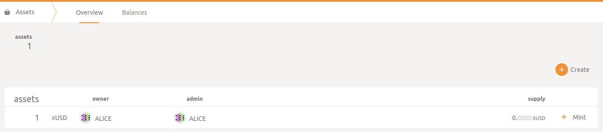
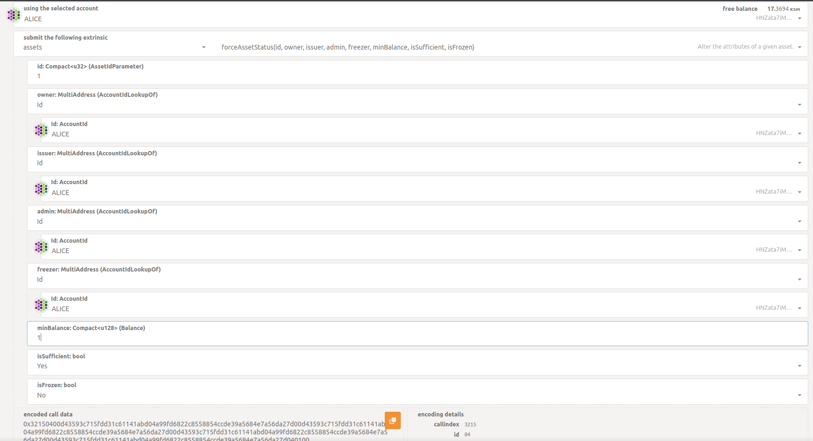
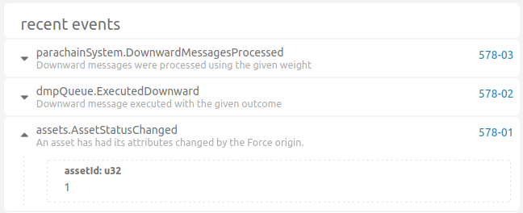
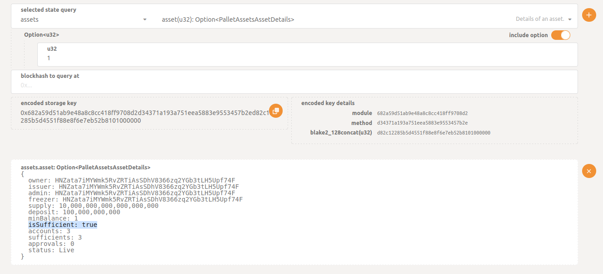

Configurar activos manualmente
===

Si quieres crear tus propios activos y hacerlos transferibles, preparamos una pequeña guia. Vamos a basarnos es <a href="./config.toml">esta configuración local</a> y crearemos xUSD en statemine y txUSD en trappist.

Primero, ve a crear los activos en ambas parachains

<ul>
  <li>asset name: xUSD / txUSD</li>
  <li>asset symbol: xUSD / txUSD</li>
  <li>asset decimals: 12</li>
  <li>minimum balance: 1</li>
  <li>asset id: 1</li>
</ul>

Statemine:

Trappist:

Si quieres transferir xUSD a txUSD en trappist, primero necesitamos marcar xUSD como sufficient para poder para tarifas con ese activo:

Ve a Developrt > Extrinsic, y prepara el extrinsc, <strong> NO </strong> hagas el submit, solo copia el encoded call data.

Luego en la relaychain, ve a Developer > sudo:

Has submit, y en statamine deberias ver:

Tambien, puedes chequear en Developer > Chain state, recarga la página y deberias ver:

Ahora, vamos a mapear el xUSD en trappist, en trappist, ve a Developer > Extrinsic:

Has el submit, y puedes chequear que el activo fue mapeado en Developer > Chain state, deberias ver:

Esos es todo, ahora estas listo para transferir xUSD a trappist.
