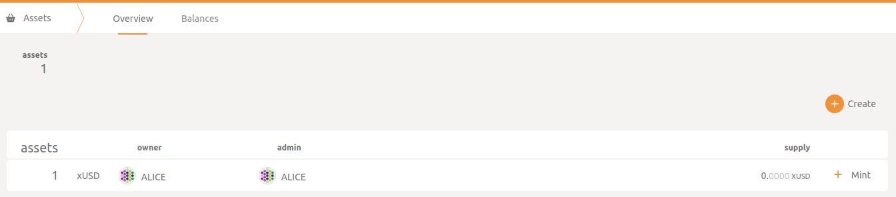
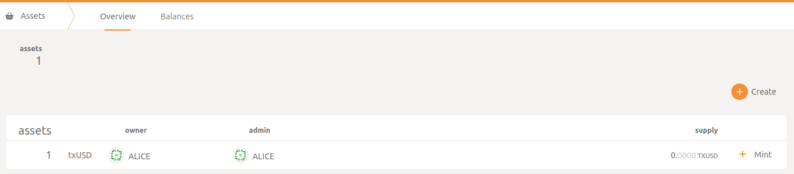
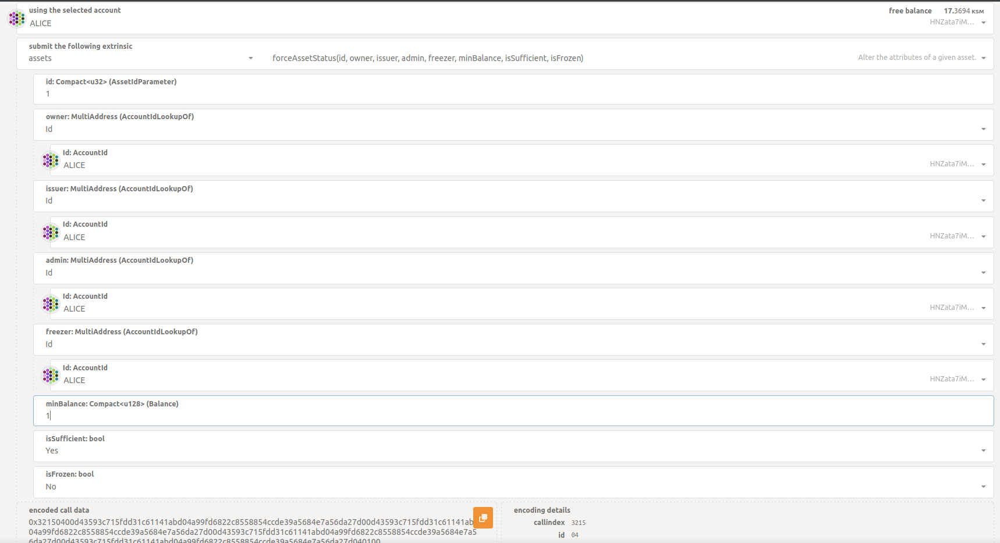
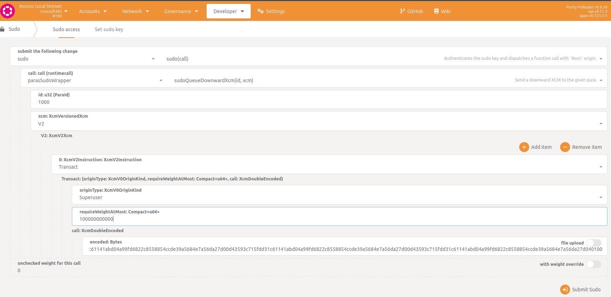
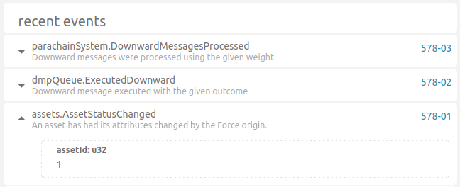
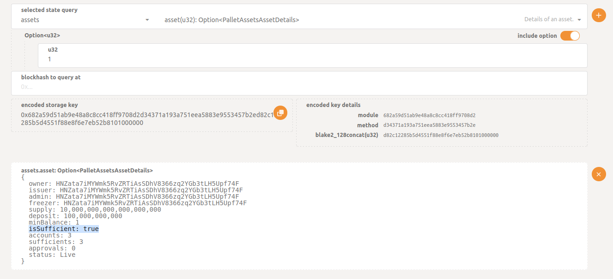
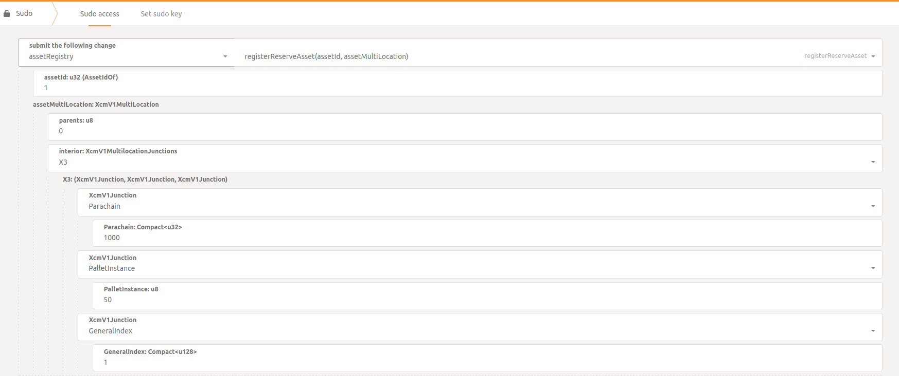
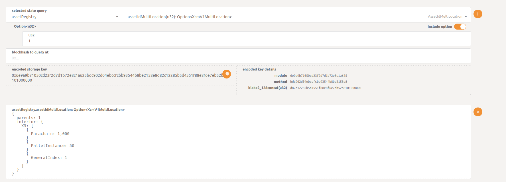

Manually Config Assets
===

If you want to create your own asset and set them as transferables, we prepared a little guide.
We're going to base in <a href="./config.toml">this local config</a> and we will create xUSD on statemine and txUSD on trappist.

First, go to create the assets in both parachains:

<ul>
  <li>asset name: xUSD / txUSD</li>
  <li>asset symbol: xUSD / txUSD</li>
  <li>asset decimals: 12</li>
  <li>minimum balance: 1</li>
  <li>asset id: 1</li>
</ul>

Statemine:

Trappist:

We want to transfer xUSD to txUSD on trappist, first we need to set xUSD as sufficient to be able to pay fees with that asset:

Go to Developer > Extrinsic, and prepare the extrinsic, <strong> DON'T </strong> submit, just copy the encoded call data.

Then on the relay chain, go to Developer > sudo:

Submit, and in Statemine you should see this:

Also, you can check in Developer > Chain state, reload the page and you should see:

Now, we have to map xUSD in trappist, in trappist, go to Developer > Extrinsic:

submit, you can check if the asset was mapped in Developer > chain state, you should see this:

That's all, now you're ready to transfer xUSD to trappist.
