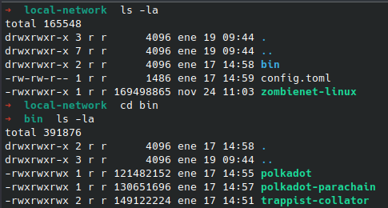

Configurar Red Local
=======

Este es un tutorial para ejecutar una red local con una relay chain de rococo y dos parachains (statemin y trappist)

Necesitas descargar     <a href="https://github.com/paritytech/zombienet/releases">Zombienet para linux linux macOs</a> y para fines de pruebas, hemos preparado algunos binarios de parachain que  puedes descargar todos los binarios desde:

<ul>
  <li><a href="https://blockcoders.nyc3.cdn.digitaloceanspaces.com/xcm-sdk%2Fpolkadot">Polkadot</a></li>
  <li><a href="https://blockcoders.nyc3.cdn.digitaloceanspaces.com/xcm-sdk%2Fpolkadot-parachain">Polkadot Parachain</a></li>
  <li><a href="https://blockcoders.nyc3.cdn.digitaloceanspaces.com/xcm-sdk%2Ftrappist-collator">Trappist Collator</a></li>
</ul>

Luego, crea una carpeta llamada bin con los binarios dentro y copia <a href="./config.toml">este config.toml</a>, tu carpeta deberia verse como esto:



hacer todos los binarios ejecutables:

```sh
sudo chmod +x polkadot
sudo chmod +x polkadot-parachain
sudo chmod +x trappist-collator
sudo chmod +x zombienet-linux
```

corre:

```sh
# or ./zombienet-macos
./zombienet-linux -p native spawn config.toml
```

Si quieres correrlo en windows ve: <a href="https://github.com/paritytech/zombienet">repositorio de zombienet</a>

## Relay chain y Parachains

Hay una configuración por defecto:

<ul>
  <li>Relay chain está en el puerto 9900</li>
  <li>Statemine Parachain está en el puerto 9910 con <Strong> id 1000 </strong> </li>
  <li>Trappist Parachain está en el puerto 9920 con <strong> id 2000 </strong> </li>
    <li>Otra Trappist Parachain está en el puerto 9920 con <strong> id 2000 </strong> </li>

</ul>


## Configurar Activos

Si quieres transferir activos entra parachains, nosotros ya hemos preparado un script que creará un activo xUSD en statemine y un activo txUSD en trappist. Serás capas de transferir solo xUSD a txUSD. Toma alrededor de 30 segundos para terminar.

correr script:

```sh
npx ts-node src/examples/local-network/config-assets.ts
```

Luego, mintea algunos activos a Alice (para los ejemplos) o a otra cuenta. Recomendamos mintear 10000000 (1 millon de xUSD) para tener suficientes xUSD para transferencias de prueba.

Si quieres crear tus propios assets, puedes seguir <a href="./manually-config-assets-es.md">esta guia</a> que preparamos.

## Ejemplos

Todos los ejemplos tienen a Alice como cuenta origen y a bob como cuenta destino por defecto. Si quieres cambiarla, modifica src/examples/local-network/local-network-utils.ts

configuración por defecto:

```ts
export const localNetworkUtils = {
  relayRpc: 'ws://127.0.0.1:9900',
  parachain1Rpc: 'ws://127.0.0.1:9911',
  parachain2Rpc: 'ws://127.0.0.1:9921',
  parachain1ChainId: 1000,
  parachain1DestinationAccount: 'FoQJpPyadYccjavVdTWxpxU7rUEaYhfLCPwXgkfD6Zat9QP', // bob account on statemine
  parachain2ChainId: 2000,
  parachain2DestinationAccount: '5FHneW46xGXgs5mUiveU4sbTyGBzmstUspZC92UhjJM694ty', //bob account on trappist
  relayChainDestintionAccount: '5FHneW46xGXgs5mUiveU4sbTyGBzmstUspZC92UhjJM694ty', // bob account on relay
}
```

### Transferir Activo de Relaychain a Statemine

comando:
```ts
npx ts-node src/examples/local-network/teleportAssets-to-parachain.ts
```

manual:
```ts
  const destination = "Parachain"
  const destinationValue = 1000 // Statemine parchain id
  const beneficiary = "AccountId32"
  const beneficiaryValue = "<bob acount>" // account address
  const amount = 1000000000000000

  const res = await provider.teleportAssets({
    destination,
    destinationValue,
    beneficiary,
    beneficiaryValue,
    amount,
  });
```

### Transferir Activo de Statemine a Relaychain

comando:
```ts
npx ts-node src/examples/local-network/limitedTeleportAssets-to-relaychain.ts
```

manual:
```ts
  const destinationParents = 1
  const beneficiary = 'AccountId32'
  const beneficiaryValue = "<bob account>"
  const assetParents = 1
  const amount = 1000000000000

  const res = await provider.limitedTeleportAssets({
    destination,
    destinationValue,
    beneficiary,
    beneficiaryValue,
    amount,
  });
```

### Transferir xUSD de statemine a txUSD en Trappist

Asegurate de que Alice tenga suficientes xUSD minteados, y ya hayas ejecutado el script para la configuración de los activos.

comando:
```ts
npx ts-node src/examples/local-network/limitedTeleportAssets-to-relaychain.ts
```

manual:
```ts
  const destination = 'Parachain'
  const destinationValue = 2000 // trappist parachain id
  const destinationParents = 1
  const beneficiary = 'AccountId32'
  const beneficiaryValue = "<bob account>"
  const assetId = 1 // xUSD
  const amount = 100000000000000 // 100 xUSD

  const res = await provider.limitedReserveTransferAssets({
    destination,
    destinationValue,
    destinationParents,
    beneficiary,
    beneficiaryValue,
    assetId,
    amount,
  })
```
